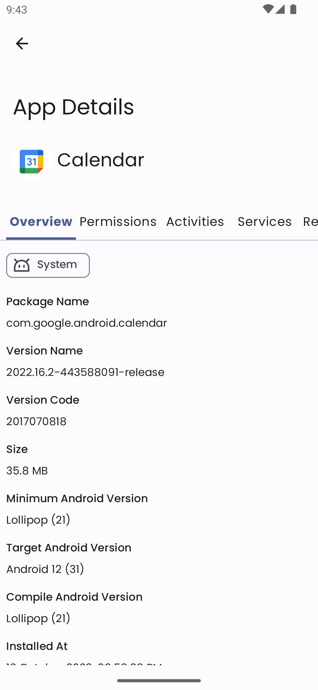

# AppsCatalog
One stop insight details provider for applications installed on your Android device.

 

### Screenshots

| .png)  | .png)  |
|---|---|
|   |   |
.png)  

### Required Files

**config/signing.properties**

~~~
storePassword={Keystore password here}
keyAlias={Key alias}
keyPassword={Key password}
~~~

**config/sonar.properties**

~~~
# https://docs.sonarcloud.io/advanced-setup/ci-based-analysis/sonarscanner-for-gradle/#analyzing
# SonarQube properties
sonar.host.url={host url}
sonar.token={token}
sonar.organization={organization}

# Project properties
sonar.projectKey={project key}
sonar.projectName={app name}
sonar.projectVersion={app version}
~~~
Google services json => **app/google-services.json**

Service credential file for firebase app distribution => **config/apps-catalog-e4a0b-140bcb296b4b.json**

App keystore => **apps_catalog_keystore**